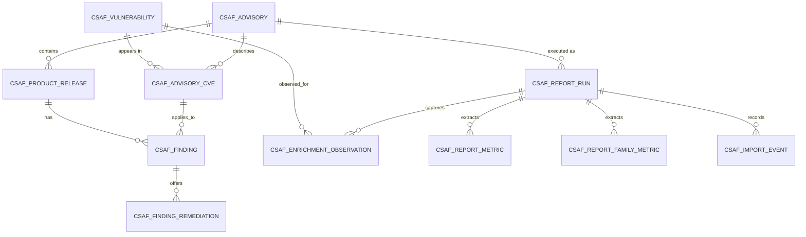

# CSAF Analytics Data Model and Import Contract

| | |
|---|---|
| **Status** | Proposed baseline for review |
| **Version** | 0.1 |
| **Date** | 2026-08-11 |
| **Scope** | Target persistence model and ZIP import contract |

## 1. Purpose

This document defines the first concrete technical baseline for CSAF Analytics
before database DDL, PL/SQL import services or APEX pages are implemented. It
freezes:

- the uploaded bundle contents;
- the grain and identity of the target tables;
- the mapping from every imported artifact to permanent storage;
- idempotency, conflict and transaction rules;
- the intended disposition of the undeployed Phase 0 database prototypes.

The current APEX application has no CSAF database objects or imported CSAF
data. The target model can therefore be installed cleanly. The Phase 0 scripts
are reference material only.

## 2. Decisions

1. One Python execution produces one immutable report run.
2. The APEX operator uploads one ZIP containing exactly six root-level files.
3. The original CSAF JSON is retained under its published filename, for
   example `cpujul2026csaf.json`, for audit, reprocessing and parser regression
   testing.
4. The original ZIP is retained byte-for-byte.
5. Advisory facts are immutable per formal revision and source hash.
6. A CSAF product identifier is scoped to its advisory document.
7. Enrichment observations belong to the exact report run, not only to a date.
8. Frequently displayed metrics are extracted during import, while JSON and
   CSV artifacts remain the evidence behind them.
9. Validation cannot modify canonical facts.
10. Confirmed promotion is one atomic transaction.

## 3. ZIP bundle contract

### 3.1 Required archive layout

```text
<batch-id>.zip
├── manifest.json
├── cpujul2026csaf.json
├── report-data.json
├── report-cpujul2026.html
├── findings.csv
└── enrichment.csv
```

All entries must be regular files at the archive root. The HTML filename is
read from `manifest.files.report_html`; for example, `cpujul2026csaf.json`
produces `report-cpujul2026.html`. Directories, nested paths, absolute paths,
duplicate normalized names, symbolic-link-like entries
and additional files are rejected.

The source entry keeps the original published basename recorded in
`manifest.source_filename`. For example, a source downloaded from
`https://www.oracle.com/docs/tech/security-alerts/cpujul2026csaf.json` remains
`cpujul2026csaf.json` in the output directory and ZIP. Its content is the exact
byte sequence parsed by the Python generator. Its SHA-256 must equal both
`manifest.csaf_source_hash` and the corresponding entry in
`manifest.file_hashes`.

The source name must be a plain root-level basename ending in `.json`. Path
separators, `.` or `..`, control characters and names colliding with the five
generated artifact names are rejected. The importer requires
`manifest.files.source_csaf` and `manifest.source_filename` to be identical.

### 3.2 Manifest change

The generator uses format version `3` and includes the original source file in
`files`. This is a contract change from the earlier five-artifact format
version `2`.

```json
{
  "format_version": 3,
  "files": {
    "source_csaf": "cpujul2026csaf.json",
    "findings": "findings.csv",
    "enrichment": "enrichment.csv",
    "report_data": "report-data.json",
    "report_html": "report-cpujul2026.html"
  },
  "file_hashes": {
    "source_csaf": "<sha-256>",
    "findings": "<sha-256>",
    "enrichment": "<sha-256>",
    "report_data": "<sha-256>",
    "report_html": "<sha-256>"
  }
}
```

The manifest does not hash itself. The server calculates the SHA-256 of the
complete uploaded ZIP and stores it as `bundle_hash`.

### 3.3 Initially supported versions

The first importer accepts only an explicitly configured combination:

- bundle format version `3`;
- report schema version `7`;
- CSAF source version `2.0`.

Unsupported versions fail validation before canonical promotion. Supporting a
new version requires an explicit mapping change and regression tests.

## 4. Target data model

### 4.1 Relationship overview



### 4.2 `CSAF_REPORT_RUN`

**Grain:** one row per Python execution/uploaded bundle.

Core fields:

- `report_run_id` — surrogate primary key;
- `batch_id` — unique Python execution identity;
- `advisory_id` — nullable during validation, required after promotion;
- bundle format and report schema versions;
- execution start time and enrichment observation date;
- advisory reference, revision and source hash copied for validation/audit;
- findings, enrichment, CVE and product counts;
- EPSS, KEV and NVD source-health statuses;
- import status and bundle hash;
- original upload filename and size;
- uploaded ZIP BLOB, source CSAF BLOB, manifest CLOB, report JSON CLOB and
  report HTML BLOB;
- uploader, lifecycle timestamps and sanitized error summary.

`batch_id` is unique. Initial status values are:

```text
RECEIVED  VALIDATING  VALIDATED  IMPORTING  SUCCESS  PARTIAL
FAILED    CONFLICT    CANCELLED  EXPIRED
```

Only `SUCCESS` and `PARTIAL` runs are visible as imported packages.

### 4.3 `CSAF_ADVISORY`

**Grain:** one row per vendor advisory and formal revision.

It stores a surrogate key, vendor, reference, revision, title, advisory URL,
publication and revision dates, TLP, source filename/URL/hash and first-loaded
timestamp.

Business uniqueness:

```text
(vendor, advisory_reference, advisory_revision)
```

The identity with the same source hash is reused. The same identity with a
different source hash is a conflict requiring explicit review.

### 4.4 `CSAF_PRODUCT_RELEASE`

**Grain:** one CSAF product identifier within one advisory revision.

It stores `product_release_id`, `advisory_id`, `csaf_product_id`, family,
product name, version and CPE.

Business uniqueness:

```text
(advisory_id, csaf_product_id)
```

A future cross-advisory product dimension may be added through a separate
curated mapping, preferably using CPE and explicit analyst review.

### 4.5 `CSAF_VULNERABILITY`

**Grain:** one global CVE identity.

It stores the CVE, CVE year, first-seen advisory and timestamps.
Advisory-specific descriptions are not stored here because vendor wording may
change between advisories or revisions.

### 4.6 `CSAF_ADVISORY_CVE`

**Grain:** one CVE as described by one advisory revision.

It stores a surrogate key, `advisory_id`, `cve` and the advisory-specific
description, with uniqueness on `(advisory_id, cve)`.

### 4.7 `CSAF_FINDING`

**Grain:** one advisory-CVE/product-release relationship.

It stores a surrogate key, advisory CVE, product release, status, VEX
justification, component and third-party component, CVSS score/vector/source,
decomposed CVSS fields, decision flags and vendor bug ID.

Business uniqueness:

```text
(advisory_cve_id, product_release_id)
```

### 4.8 `CSAF_FINDING_REMEDIATION`

**Grain:** one remediation associated with one finding.

It stores a surrogate key, finding key, remediation category, URL,
note/reference and optional display order. The flattened remediation currently
emitted by `findings.csv` maps to one child row when any remediation field is
present.

### 4.9 `CSAF_ENRICHMENT_OBSERVATION`

**Grain:** one CVE observation in one report run.

It stores `report_run_id`, CVE, observation date, EPSS and percentile, KEV
fields, public exploit-reference fields, and individual source statuses.

Business uniqueness:

```text
(report_run_id, cve)
```

Multiple runs on the same day remain independent. A current-state view selects
the latest successful observation by execution timestamp and import time.

### 4.10 Reporting metrics

`CSAF_REPORT_METRIC` has one row per `(report_run_id, metric_name)` and stores
report-level numeric values extracted from `report-data.json`.

`CSAF_REPORT_FAMILY_METRIC` has one row per report run and product family and
stores affected findings, pre-auth findings, affected products, affected
versions and affected CVEs.

The JSON remains authoritative for reproducing the generated report. Extracted
metrics are query-optimized projections and must reconcile to it.

### 4.11 `CSAF_IMPORT_EVENT`

**Grain:** one lifecycle or diagnostic event for one report run.

It stores an event ID, report-run ID, event type, severity, timestamp, actor,
sanitized operator message and restricted technical diagnostic.

### 4.12 Staging

Run-keyed staging structures mirror the complete CSV contracts as text where
conversion is required. Every row is tied to `report_run_id` and carries the
validated `batch_id`.

Staging is never the analytical source. It may be purged after successful
promotion. Failed staging may be retained temporarily for authorized diagnosis
and then expired automatically.

## 5. Artifact-to-storage mapping

### 5.1 `manifest.json`

| Manifest field | Permanent destination |
|---|---|
| `format_version` | `CSAF_REPORT_RUN.bundle_format_version` |
| `batch_id` | `CSAF_REPORT_RUN.batch_id` |
| `execution_started_at` | `CSAF_REPORT_RUN.execution_started_at` |
| Advisory reference/revision | Run validation fields and `CSAF_ADVISORY` |
| `csaf_source_hash` | Run validation field and `CSAF_ADVISORY.source_hash` |
| Source filename/URL | Run and advisory provenance |
| `observation_date` | `CSAF_REPORT_RUN.observation_date` |
| Finding/enrichment/report counts | Dedicated report-run count columns |
| `source_statuses` | Run source-health fields and retained manifest |
| `files` and `file_hashes` | Contract validation and retained manifest |
| Complete document | `CSAF_REPORT_RUN.manifest_json` |

### 5.2 Original CSAF JSON

| Content | Permanent destination |
|---|---|
| Exact source bytes | `CSAF_REPORT_RUN.source_csaf` |
| SHA-256 | Run source hash and advisory source hash |
| Parsed tracking metadata | Reconciled with manifest, CSV and advisory |

APEX does not reimplement the complete Python CSAF parser during normal import.
It validates identity and preserves the source for audit and reprocessing.

### 5.3 `findings.csv`

| CSV fields | Canonical destination |
|---|---|
| `batch_id` | Validation against report-run batch ID |
| Vendor, reference, revision, title and advisory URL | `CSAF_ADVISORY` |
| Source provenance, dates and TLP | `CSAF_ADVISORY` and run validation |
| `cve` | `CSAF_VULNERABILITY` and `CSAF_ADVISORY_CVE` |
| `description` | `CSAF_ADVISORY_CVE.description` |
| Product ID, family, name, version and CPE | `CSAF_PRODUCT_RELEASE` |
| Status, VEX and component fields | `CSAF_FINDING` |
| CVSS fields and derived decision flags | `CSAF_FINDING` |
| Vendor bug ID | `CSAF_FINDING` |
| Fix URL, note and category | `CSAF_FINDING_REMEDIATION` |

### 5.4 `enrichment.csv`

All fields other than `batch_id` map to
`CSAF_ENRICHMENT_OBSERVATION`. `batch_id` must match the report run. Each CVE
must exist in the package findings. The initial contract does not support
enrichment-only ZIPs.

### 5.5 `report-data.json`

| JSON section | Destination |
|---|---|
| Complete document | `CSAF_REPORT_RUN.report_json` |
| Schema/prioritization versions | Report-run fields |
| Batch, advisory and observation identity | Reconciled with other artifacts |
| `kpis` | `CSAF_REPORT_METRIC` |
| `aggregates.product_families` | `CSAF_REPORT_FAMILY_METRIC` |
| Other aggregates and read models | Retained in JSON initially |
| Source status and data quality | Reconciled and retained; selected values may be extracted later |

New extracted metrics require a versioned mapping change, not a rewrite of
historical JSON.

### 5.6 Generated HTML report

The exact bytes are stored in `CSAF_REPORT_RUN.report_html`. They are never
inserted into the import page DOM. Historical display uses a controlled
endpoint and sandboxed iframe under the application authorization policy.

### 5.7 Original ZIP

The complete uploaded bytes are stored in `CSAF_REPORT_RUN.uploaded_bundle`.
The server-calculated SHA-256 is stored as `bundle_hash`. This is the immutable
audit artifact from which every extracted file can be recovered.

## 6. Identity, idempotency and conflicts

| Situation | Required result |
|---|---|
| Same batch ID and bundle hash | Return the existing run; promote nothing |
| Same batch ID, different bundle hash | `CONFLICT` |
| Same advisory identity and source hash, later batch | Reuse facts; insert new run, enrichment and metrics |
| Same advisory identity, different source hash | `CONFLICT`; no overwrite |
| New formal advisory revision | Insert new advisory revision and facts |
| Same-day repeat execution | Retain distinct run and observations |
| Degraded enrichment source | Import as `PARTIAL` with explicit statuses |

Canonical findings are reused only after their stored counts and identity have
been reconciled. A failed or incomplete import is never a reusable fact set.

## 7. Validation and transaction boundary

Validation is read-only for canonical tables. It may create or update the
pending report run, staging rows and import events.

Confirmation performs one promotion transaction:

```text
claim validated run
  -> create/reuse advisory facts
  -> insert run enrichment
  -> extract metrics
  -> persist final artifacts and status
  -> commit once
```

An unexpected failure rolls back all canonical changes. A restricted logging
mechanism may record the failure without committing partial facts.

## 8. Phase 0 artifact disposition

| Phase 0 element | Disposition |
|---|---|
| Advisory revision/hash checks | Retain as import rules |
| Separation of findings and enrichment | Retain |
| Text staging and conversion helpers | Adapt to run-keyed full contracts |
| Duplicate and expected-count checks | Retain and expand |
| Partial source status | Retain |
| Global product-ID key | Replace |
| CVE/date enrichment key | Replace |
| Flattened remediation columns | Promote into child records |
| Independently committing promotion procedures | Replace with one transaction |
| Manual Data Workshop workflow | Retire for the target page |
| Phase 0 DDL/package scripts | Keep as undeployed historical reference |

## 9. Initial implementation worklist

1. Review and approve this model, especially table grains and business keys.
2. Approve manifest format version `3` and the original-filename preservation
   rule for the CSAF source.
3. Add automatic ZIP creation to the generator; source-byte preservation,
   original-basename handling and manifest hashing are implemented.
4. Extend the offline tests to cover ZIP contents and deterministic archive
   contract validation.
5. Produce an ordered Oracle target-schema installation script.
6. Produce the permanent ZIP validation and import package.
7. Add database-level positive, negative, conflict and rollback tests.
8. Build the first APEX **Import CSAF Package** section against the approved
   package API.
9. Validate with a representative large Oracle advisory and a later repeat run.
10. Reconcile database counts and metrics with the manifest and report JSON
    before enabling the dashboard link.

## 10. Open decisions before DDL

- Oracle database version and available native JSON features;
- maximum ZIP, entry, JSON, HTML and CSV sizes;
- retention periods for successful bundles and failed/pending uploads;
- whether technical diagnostics require a separate restricted table;
- whether remediation identity needs more CSAF fields in the first release;
- whether derived flags are stored and validated or implemented as virtual
  columns;
- whether source URLs require sanitization for credentials or sensitive query
  parameters.

## 11. Acceptance criteria for the model baseline

The baseline is ready for DDL when:

- every imported field has an explicit destination or exclusion decision;
- grains and uniqueness rules handle repeated and same-day executions;
- the original CSAF source and all generated artifacts are retained;
- no document-scoped identifier is treated as globally unique;
- validation and promotion transaction boundaries are agreed;
- duplicate, reuse, partial and conflict outcomes are unambiguous;
- the model supports both the initial import page and the future package-history
  page without changing primary identities.
